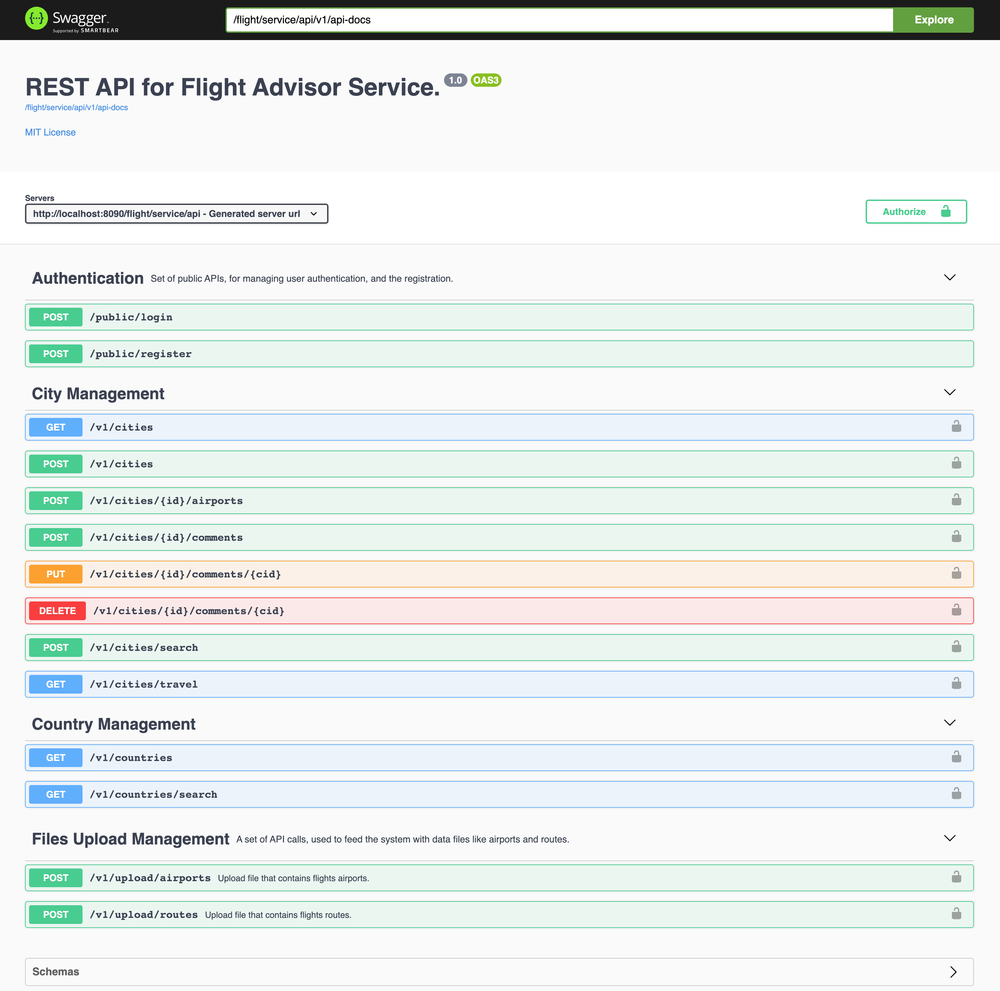
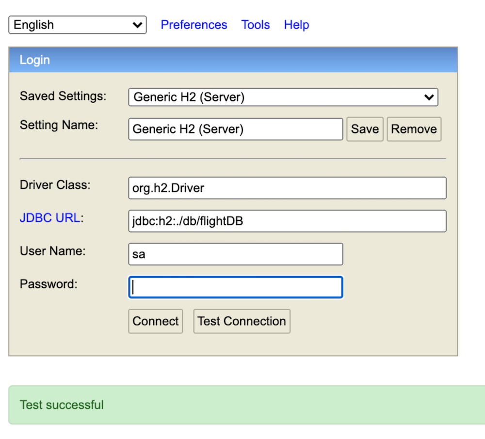

# Flight Advisor Service  [](https://github.com/mohamed-taman/Flight-Advisor/releases)
[](https://twitter.com/_tamanm)
Flight advisor Service, is a set of APIs for primarily finding the cheapest flight when traveling from city A to city B based on price, returning all the trip information alongside the distance.

## System Functionality
- This project is a development of a layered monolith **Spring Boot** based project (Latest version 2.4.0), with in-memory database.
- This project is a OAuth2 based project, using JWT token to secure endpoints. So you need to register first in order to continue using the system.
- The functionality is reached based on user role, and there are three roles in the system.
    - **Admin**: user is a predefined user (*admin@traveladvisor.com/Admin1234*). 
        - Admin need to login first through `/login` API to get their token to contact the system.
        - This user can upload airports and the flight routes.
        - Admin manages cities by adding, updating or deleting them.
        - Actually admin can do anything in the system.
    -  **Client**: Clients should register first before using the system through `/register` public API. 
        -  After successful registration they can then use public `/login` API to get token to successfully contact the system.
        - Client can use all read API calls.
        - Client can add can manage their comments for a city, add, update, delete their comments, and see other comments.
        - User can get the cheapest flight by calling `/cities/travel` API and provide airport codes for [from city] and [to city].
    -  **Public**: it is not a role but APIs under public is used by any anonymous users.
        - Use `/login` API to login to the system, with username and password. Then you will get a valid token.
        - Use `/register` API, to register as client to be able to use the system fanctionality.

## Getting started
### Project Management
1. I have used GitHub projects to manage my tasks in the **Flight-Advisor** project. [Project Link](https://github.com/mohamed-taman/Flight-Advisor/projects/1).
2. All MVP tasks are assigned to the **Flight Advisor API MVP** Milestone. [Milestone Link](https://github.com/mohamed-taman/Flight-Advisor/milestone/1?closed=1).
3. I used pull requests to manages and close assigned tasks. [Tasks Link](https://github.com/mohamed-taman/Flight-Advisor/issues?q=is%3Aclosed).
4. Finally, I have added releases to manage small features sprints until the final release v1.0. [Releases Link](https://github.com/mohamed-taman/Flight-Advisor/releases).
5. Have a look at opened issues for future enhancements. [Opened Issues](https://github.com/mohamed-taman/Flight-Advisor/issues?q=is%3Aopen).

### System components Structure
Let's explain first the system layers structure to understand its components:
```
Flight-Advisor --> Parent folder. 
|- docs --> Contains system images.
|- data --> Contains Airports and routes files. 
|- src/main/java - org.siriusxi.htec.fa (package) 
  |- FlightAdvisorApplication.java --> The main starting point of the application.
  |- api --> Contains All REST API controllers that receive requests from the client,
             to process the that request, and finally return appropriate responses.
  |- repository --> All the database entities CRUD management services. 
  |- domain --> Domain contains all the database modeled entities, 
                all request and response DTOs, as well as the mappers.
  |- infra --> Contains all the configurations, exceptions, security management, 
               and support utilities to the system. 
  |- service --> Contains all the system business login, 
                 recives calls from Controllers, call repository to retrieve and manage data, 
                 then process them to returned them back to Controllers. 
```
Now, as we have learned about different system layers, then let's start.

## Playing With Flight Advisor Project
First things first, download the following pics of software to have fun with the project:
### Required software

The following are the initially required software pieces:
1. **Maven**: it can be downloaded from https://maven.apache.org/download.cgi#.
2. **Git**: it can be downloaded from https://git-scm.com/downloads.
3. **Java 15.0.1**: it can be downloaded from https://jdk.java.net/15/.

Follow the installation guide for each software website link and check your software versions from the command line to verify that they are all installed correctly.

### Cloning It

Now it is the time to open **terminal** or **git bash** command line, and then simply clone the project under any of your favorite places with the following command:

```bash
> git clone https://github.com/mohamed-taman/Flight-Advisor.git
```

### Using an IDE
I recommend that you work with your Java code using an IDE that supports the development of Spring Boot applications such as **Spring Tool Suite** or **IntelliJ IDEA Community | Ultimate Edition**. 

All you have to do is just fire up your favourite IDE **->** open or import the parent folder `Flight-Advisor`, and everything will be ready for you.

### Building & Running The System
To build and run the system, run the following command:

```bash
👻 [mtaman]:Flight-Advisor ~~ ./mvnw clean package
```
Now you should expect output like this:
```bash
[INFO] Tests run: 1, Failures: 0, Errors: 0, Skipped: 0
[INFO] 
[INFO] 
[INFO] --- maven-jar-plugin:3.2.0:jar (default-jar) @ flight-advisor ---
[INFO] Building jar: /Flight-Advisor/target/flight-advisor-1.0.jar
[INFO] 
[INFO] --- spring-boot-maven-plugin:2.4.0:repackage (repackage) @ flight-advisor ---
[INFO] Replacing main artifact with repackaged archive
[INFO] ------------------------------------------------------------------------
[INFO] BUILD SUCCESS
[INFO] ------------------------------------------------------------------------
[INFO] Total time:  14.620 s
[INFO] Finished at: 2020-12-15T13:40:50+01:00
[INFO] -----------------------------------------------------------------------
```
#### Running the System
Now it's the time to run the system, and it's straightforward, just hit the following commands:

```bash
👻 [mtaman]:Flight-Advisor ~~ java --enable-preview -jar ./target/*.jar \ 
👻 [mtaman]:Flight-Advisor ~+ --spring.profiles.active=prod
```
Or
```bash
 👻 [mtaman]:Flight-Advisor ~~ ./mvnw spring-boot:run \
 👻 [mtaman]:Flight-Advisor ~+ -Dspring-boot.run.jvmArguments="--enable-preview" \
 👻 [mtaman]:Flight-Advisor ~+ -Dspring-boot.run.arguments="--spring.profiles.active=prod"
```
**Flight Advisor System** will run, with embedded H2 **database** that will be created under `db` folder and then the `flightDB.mv.db` file, and you should expect an output like this:

```bash
2020-12-15 13:56:16.587  INFO 2981 --- [  restartedMain] o.s.b.a.h2.H2ConsoleAutoConfiguration: 
H2 console available at '/db-console'. 
Database available at 'jdbc:h2:./db/flightDB'

2020-12-15 13:56:18.081  INFO 2981 --- [  restartedMain] o.s.b.w.embedded.tomcat.TomcatWebServer: 
Tomcat started on port(s): 8090 (http) with 
context path '/flight/service/api'

2020-12-15 13:56:18.581  INFO 2981 --- [  restartedMain] o.s.h.f.F.AppStartupRunner: 
Congratulations, Flight Advisor Application is Up & Running :)
```
### Access Flight Advisor System APIs
You can play and test `Flight Advisor` APIs throughout its **OpenAPI** interface. 
1. Go to landing page at the following URL [http://localhost:8090/flight/service/api/](http://localhost:8090/flight/service/api/).
2. follow the link on the page and you should see the following:



#### System Behaviour
1. First if you want to upload airports or routes (in data folder) using **Files upload Management** section: 
     1. You need to login with provided admin username/password to `public/login` endpoint.
     2. On successful login, the response will contain authorization token, copy it.
     3. Click on Authorize button and past it in the only field out there `value` then click `Authorize` button.
     4. Now all lock are closed and you can use the secured APIs.
2. If you are new client and want to access the system you need first to register through `/public/register` endpoint. Then follow previous point **1.i**.
3. When uploading Airports file, countries and cities will be created automatically.
4. All search parameters are case insensitive, and system use like search by default.
5. To add city you need a country, so from **country management** section you can search for the country you want.
6. To add manage comments you need a city, so from **city management** section you can get all cities or search for a specific city.
7. You can search for all airports for specific city to know thier codes so you can use the travel service.
8. Use travel service to search the cheapest flight from city to city, for example traveling from **CAI** (*Cairo International Airport, Egypt*) to **LAX** (*Los Angeles, USA*) the following results will returned:

```JSON
[
  {
    "start": {
      "airport": "Cairo International Airport",
      "city": "Cairo",
      "country": "Egypt",
      "iata": "CAI"
    },
    "through": [
      {
        "airport": "Lester B. Pearson International Airport",
        "city": "Toronto",
        "country": "Canada",
        "iata": "YYZ"
      }
    ],
    "end": {
      "airport": "Los Angeles International Airport",
      "city": "Los Angeles",
      "country": "United States",
      "iata": "LAX"
    },
    "price": {
      "total": 62.17,
      "currency": "US"
    },
    "distance": {
      "total": 12722.2,
      "in": "KM"
    }
  }
]
```


### Access Flight Advisor System Database
You can access database through it online console from the following URL [http://localhost:8090/flight/service/api/db-console/](http://localhost:8090/flight/service/api/db-console/) with the following properties:
- Driver class: `org.h2.Driver`
- JDBC URL: `jdbc:h2:./db/flightDB`
- user: `sa`
- password: `Admin1234`



Hit test, and it should show a green bar for successful settings. So hit **Connect** button and explore all data.

### Stopping The System
Just press `CTRL+C` keys on terminal.

### Closing The Story

Finally, I hope you enjoyed the application and find it useful. If you would like to enhance please open **PR**, and finally give it a 🌟.

## The End
Happy Coding 😊 

## License
Copyright (C) 2020 Mohamed Taman, Licensed under the **MIT License**.
