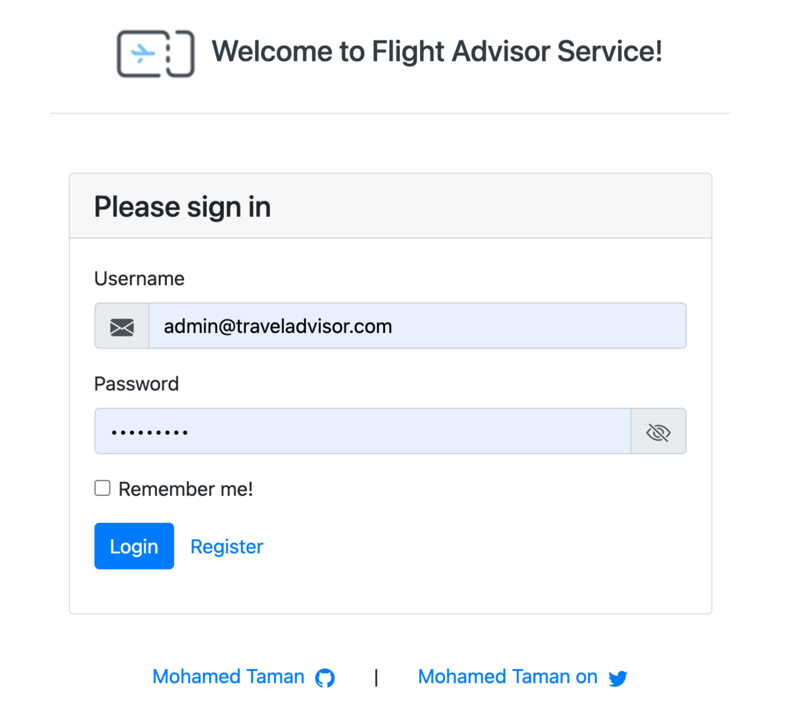
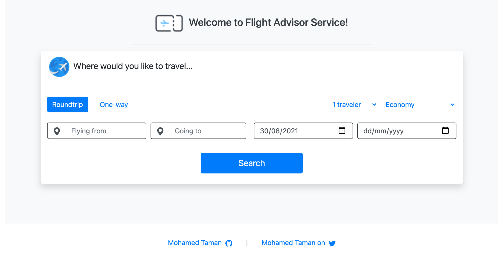

# Flight Advisor Service  [](https://github.com/mohamed-taman/Flight-Advisor/releases) [](https://twitter.com/_tamanm)

Flight Advisor Service is a set of APIs for primarily finding the cheapest flight from city A to
City B is based on price, and as a result, it returns all the trip information alongside the
distance(s).

> This service is a great example of migrating spring boot from the older version **2.7.x** to **3.1.x**. You can check the changes from commit changes of each version release (as code) or release notes as information. And the [**Spring Boot 2.5.x to 3.1.x migration Guide**](https://medium.com/@tamanm/spring-boot-2-x-to-3-1-x-migration-guides-e83380dbc470) would help you in your migration journey.

## System Functionality

- This project is developing a layered monolith **Spring Boot** based project (with the latest
  version **3.4.0-M1**), on **Java 22**, and with an embedded database mode.
- This OAuth2-based project uses a JWT token to secure endpoints and a refresh token to get a new JWT token without login.
- Therefore, you need to register first to continue using the system.
- The functionality is reached based on user roles, and the system has three roles.
  - **Admin**: user is a predefined user (*admin@traveladvisor.com/Admin1234*).
    - Admin needs to log-in first through `/signin` API to get their token to contact the system.
    - This user can upload airports and flight routes.
    - Admin manages cities by adding, updating, or deleting them.
    - Actually, the admin can do anything in the system.
  - **Client**: Clients should register before using the system through `/signup` public API.
    - After successful registration, they can use the public `/signin` API to get a token to contact the system successfully.
    - Client can use all read API calls.
    - Clients can add, manage their comments for a city, add, update, delete their comments, and see other comments.
    - Client can get the cheapest flight by calling `/cities/travel` API and providing airport codes for [**from the city**] and [**to the city**].
  - **Public**: it is not a role, but anonymous users use APIs under public (*some APIs need access and will be marked as ACCESS REQUIRED*).
    - Use `/signin` API call to log-in to the system, supplying the username and password. Then you will get a valid JWT token with a longer living refresh token.
    - Use `/signout` to logout from the system. (**ACCESS REQUIRED**)
    - Use `/change_password` to change your current password so you will be logged-out, and you need to log-in again to access the system. (**ACCESS REQUIRED**)
    - Use `/refresh_token` when your access token is expired to get new JWT access and refresh the token with the previous not expired refresh token without login into the system again. (**ACCESS REQUIRED**)
    - Use `/signup` API call to register as a client to use the system functionalities related to the client; otherwise, the client will receive *Not Authorized*.

## Getting started

### Project Management

1. I have used GitHub projects to manage my tasks in the **Flight-Advisor** project. [Project Link](https://github.com/mohamed-taman/Flight-Advisor/projects/1).
2. All MVP tasks are assigned to the **Flight Advisor API MVP** Milestone. [Milestone Link](https://github.com/mohamed-taman/Flight-Advisor/milestone/1?closed=1).
3. I used pull requests to manage and close assigned tasks. [Tasks Link](https://github.com/mohamed-taman/Flight-Advisor/issues?q=is%3Aclosed).
4. Finally, I have added releases to manage small feature sprints until the final release, v1.0. [Releases Link](https://github.com/mohamed-taman/Flight-Advisor/releases).
5. Have a look at open issues for future enhancements. [Opened Issues](https://github.com/mohamed-taman/Flight-Advisor/issues?q=is%3Aopen).

### System components Structure

Let's first explain the system layers structure to understand its components:

```
Flight-Advisor --> Parent folder. 
|- docs --> Contains system images.
|- data --> Contains Airports and routes files.
|- frontend --> Contains the frontend UI project.
|- src/main/java - org.siriusxi.fa (package)
  |- FlightAdvisorApplication.java --> The main starting point of the application.
  |- api --> Contains All REST API controllers that receive requests from the client
             to process that request and, finally, return appropriate responses. 
             It contains all request and response DTOs.
  |- repository --> All the database entities CRUD management services. 
  |- domain --> Domain contains all the database-modeled entities.
  |- infra --> Contains all the configurations, exceptions, security management, 
               support utilities, and dto <--> entities mappers for the system support. 
  |- service --> Contains all the system business login, 
                 receives calls from Controllers, calls the repository to retrieve and manage data, 
                 then processes them to return to the controllers. 
```

Now, as we have learned about different system layers and components, so it is time then to
play, let's play.

## Playing With Flight Advisor Service

First things first, you need to download the following pieces of software to have fun with
the project:

### Required software

The following are the initially required software pieces:

1. **Maven**: it can be downloaded from https://maven.apache.org/download.cgi#.
2. **Git**: it can be downloaded from https://git-scm.com/downloads.
3. **Java 20.0.1**: it can be downloaded from https://www.oracle.com/java/technologies/downloads/#java20.
4. **Node.js 17.8+**: Latest features, can be downloaded from https://nodejs.org/en/download/current/.
5. **Angular CLI 12.2+**: Install it with the following command:
   `npm install -g @angular/cli@latest`

Follow the installation guide for each software on provided website link and check your software
versions from the command line to verify that they are all installed correctly.

### Cloning It

Now it is the time to open **terminal** or **git bash** command line, and then clone the project under any of your favorite places with the following command:

```bash
> git clone https://github.com/mohamed-taman/Flight-Advisor.git
```

### Using an IDE

I recommend that you work with your Java code using an IDE that supports the development of Spring Boot applications such as **Spring Tool Suite** or **IntelliJ IDEA Community | Ultimate Edition**.

All you have to do is fire up your favorite IDE **->** open or import the parent folder `Flight-Advisor,` everything will be ready for you.

### Building & Running The System

To build and run Flight Advisor (FA) system components, run the following command:

#### Building FA Components

##### FA backend

```bash
👻 [mtaman]:Flight-Advisor ~~ ./mvnw clean package
```

Now you should expect output like this:

```JavaScript
[INFO] Tests run: 1, Failures: 0, Errors: 0, Skipped: 0
[INFO]
[INFO]
[INFO] --- maven-jar-plugin:3.4.2:jar (default-jar) @ flight-advisor ---
[INFO] Building jar: C:\Users\...\Projects\java\Flight-Advisor\target\flight-advisor-6.0.jar
[INFO]
[INFO] --- spring-boot-maven-plugin:3.4.0-M1:repackage (repackage) @ flight-advisor ---
[INFO] Replacing main artifact C:\Users\...\Projects\java\Flight-Advisor\target\flight-advisor-6.0.jar with repackaged archive, adding nested dependencies in BOOT-INF/.
[INFO] The original artifact has been renamed to C:\Users\...\Projects\java\Flight-Advisor\target\flight-advisor-6.0.jar.original
[INFO]
[INFO] --- maven-failsafe-plugin:3.5.0:integration-test (default) @ flight-advisor ---
[INFO] --- maven-failsafe-plugin:3.5.0:verify (default) @ flight-advisor ---
[INFO] No tests to run.
[INFO] ------------------------------------------------------------------------
[INFO] BUILD SUCCESS
[INFO] ------------------------------------------------------------------------
[INFO] Total time:  25.658 s
[INFO] Finished at: 2024-09-02T14:16:57+02:00
[INFO] ------------------------------------------------------------------------
```

##### FA frontend

```bash
👻 [mtaman]:Flight-Advisor ~~ cd frontend
👻 [mtaman]:frontend ~~ npm install && ng build
```

Now you should expect output like this:

```JavaScript
removed 1 package and audited 1521 packages in 6.658s

85 packages are looking for funding
    run `npm fund` for details
  
found 6 vulnerabilities (3 low, 1 moderate, 1 high, 1 critical)
    run `npm audit fix` to fix them, or `npm audit` for details
    ✔ Browser application bundle generation complete.
    ✔ Copying assets complete.
    ✔ Index html generation complete.
  
    Initial Chunk Files | Names         |      Size
    vendor.js           | vendor        |   4.37 MB
    scripts.js          | scripts       | 153.22 kB
    polyfills.js        | polyfills     | 149.77 kB
    styles.css          | styles        | 142.28 kB
    main.js             | main          |  13.32 kB
    runtime.js          | runtime       |   6.15 kB
  
                        | Initial Total |   4.83 MB

Build at: 2022-04-13T18:30:00.555Z - Hash: ccf039ad034c30696fdb - Time: 8608ms
```

#### Running the System

Now it's the time to run the system, and it's straightforward, just hit the following commands:

##### FA backend

```bash
👻 [mtaman]:Flight-Advisor ~~ java --enable-preview -jar ./target/*.jar \ 
👻 [mtaman]:Flight-Advisor ~+ --spring.profiles.active=prod
```

Or

```bash
 👻 [mtaman]:Flight-Advisor ~~ ./mvnw spring-boot:run \
 👻 [mtaman]:Flight-Advisor ~+ -Dspring-boot.run.jvmArguments="--enable-preview" \
 👻 [mtaman]:Flight-Advisor ~+ -Dspring-boot.run.arguments="--spring.profiles.active=prod"
```

**Flight Advisor backend service** will run, with embedded H2 **database** that will be created
under `db` folder and then the `flightDB.mv.db` file, and you should expect an output like this:

```javascript
2022-04-13 13:56:16.587  INFO 2981 --- [  restartedMain] o.s.b.a.h2.H2ConsoleAutoConfiguration: 
H2 console available at '/db-console'. 
Database available at 'jdbc:h2:./db/flightDB'

2022-04-13 13:56:18.081  INFO 2981 --- [  restartedMain] o.s.b.w.embedded.tomcat.TomcatWebServer: 
Tomcat started on port(s): 8090 (http) with 
context path 'api/v1/flight/service'

2022-04-13 13:56:18.581  INFO 2981 --- [  restartedMain] o.s.h.f.F.AppStartupRunner: 
Congratulations, Flight Advisor Application, is Up & Running :)
```

##### FA frontend

```bash
👻 [mtaman]:frontend ~~ npm start
```

**Flight Advisor UI** will run, and you should expect an output like this:

```javascript
** Angular Live Development Server is listening on localhost:4200, 
   open your browser on http://localhost:4200/ **

✔ Compiled successfully.
```

### Access Flight Advisor System APIs

You can play and test `Flight Advisor` APIs throughout its **OpenAPI** interface.

1. Go to the landing page at the following URL [http://localhost:8090/api/v1/flight/service/]
   (http://localhost:8090/api/v1/flight/service/).
2. Follow the link on the page, and you should see the following:

   
3. More beautifully with its UI at [http://localhost:4200/](http://localhost:4200/), and you
   expect this view for login:

   
   And this view after login, to travel:

   

#### System Behaviour

1. First, if you want to upload airports or routes (in the data folder) using the **Files upload Management** section:
   1. Log-in with the provided admin username/password to the `auth/signin` endpoint.
   2. On successful login, the response will contain an authorization token; copy it.
   3. Click on the Authorize button and paste it into the only field out there, `value,` then click the `Authorize` button.
   4. All locks are closed, and you can use the secured APIs.
2. If you are a new client and want to access the system, you must first register through the `/auth/signup` endpoint. Then follow the previous point **1.1**.
3. When uploading the Airports file, countries and cities will be created automatically.
4. All search parameters are case-insensitive, and the system uses a `like` search by default.
5. To add a city, you need a country, so from the **country management** section, you can search for the country you want.
6. To manage comments, you need a city, so from the **city management** section, you can get all cities or search for a specific city.
7. You can search for all airports in a specific city to know their codes so that you can use travel services.
8. Use a travel service to search for the cheapest flight from city to city, for example traveling from **CAI** (*Cairo International Airport, Egypt*) to **LAX** (*Los Angeles, USA*); the following results will be returned:

```JSON
[
  {
    "start": {
      "airport": "Cairo International Airport",
      "city": "Cairo",
      "country": "Egypt",
      "iata": "CAI"
    },
    "through": [
      {
        "airport": "Lester B. Pearson International Airport",
        "city": "Toronto",
        "country": "Canada",
        "iata": "YYZ"
      }
    ],
    "end": {
      "airport": "Los Angeles International Airport",
      "city": "Los Angeles",
      "country": "United States",
      "iata": "LAX"
    },
    "price": {
      "total": 62.17,
      "currency": "US"
    },
    "distance": {
      "total": 12722.2,
      "in": "KM"
    }
  }
]
```

### Access Flight Advisor System Database

You can access the database through its online console from the following URL
[http://localhost:8090/api/v1/flight/service/db-console/]
(http://localhost:8090/api/v1/flight/service/db-console/) with the following properties:

- Driver class: `org.h2.Driver`
- JDBC URL: `jdbc:h2:./db/flightDB`
- user: `sa`
- password: `Admin1234`



Hit test, and it should show a green bar for successful settings. So hit the **Connect** button and explore all data.

### Stopping The System

Just press the `CTRL+C` keys on the terminal.

### Closing The Story

Finally, I hope you enjoyed the application and found it useful. If you would like to enhance it, please open **PR**, and yet give it a 🌟.

## The End

Happy Coding 😊

## License

Copyright (C) 2023 Mohamed Taman, Licensed under the **MIT License**.

<!-- https://www.toptal.com/spring/spring-security-tutorial -->
